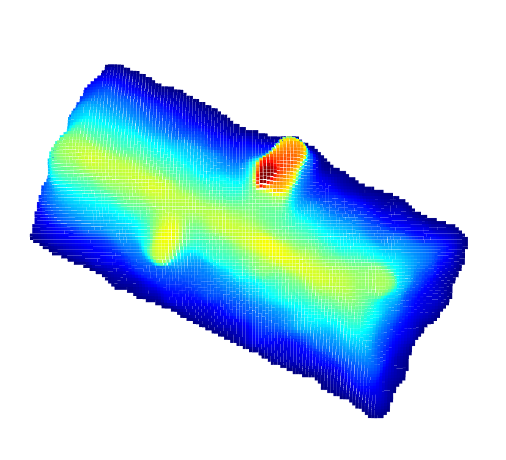
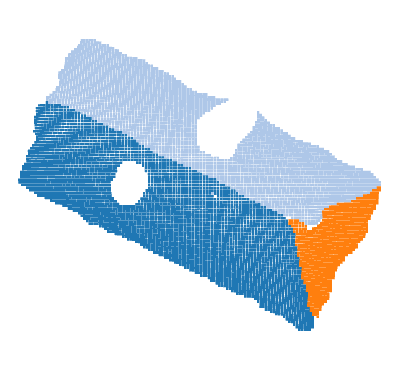
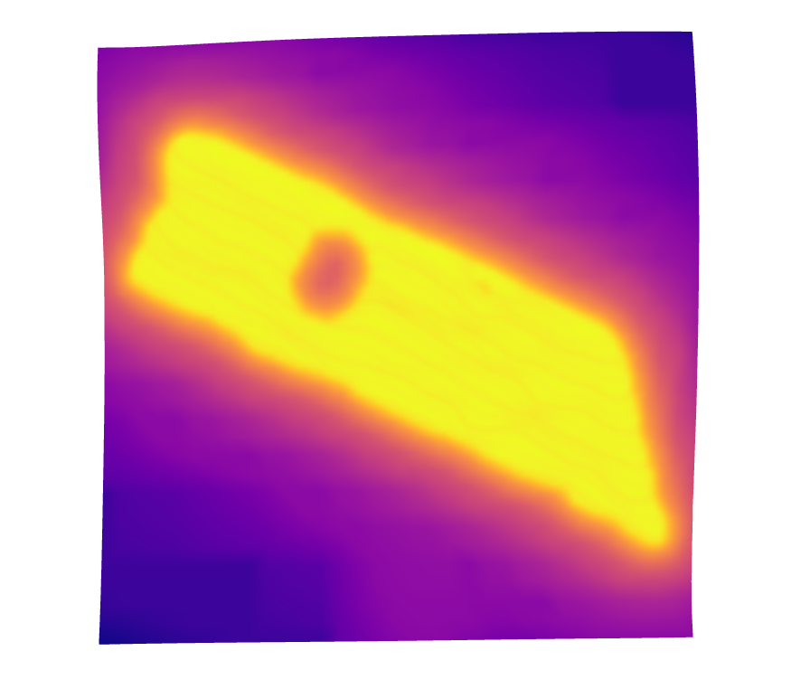

# Rooftop Segmentation on Point Clouds

Rooftop segmentation in point cloud data holds significant importance in various fields, including urban planning, architecture, and environmental monitoring. By accurately segmenting rooftops from the surrounding environment, we can extract crucial information about building structures and their characteristics. This process enables us to assess building conditions, plan for urban development, and even optimize energy efficiency through solar panel placement.

In our project, we are especially interested in the last part. The automated detection of rooftops and the assessment of their solar potential are our main goals in this project. 

## Point Cloud Segmentation Through RANSAC and Euclidean Clustering 


The following code is implemented with the aim of determining the optimal value for the distance_threshold hyperparameter during the execution of the RANSAC algorithm. What we do is that we compute the mean distance between the points and set this as the threshold value.
```py
tree = KDTree(np.array(pcd.points), leaf_size=2)
nearest_dist, nearest_ind = tree.query(pcd.points, k=8)
mean_distance = np.mean(nearest_dist[:,1:])
optimal_distance_threshold = mean_distance
```
Below the implementation of the RANSAC algorithm and the Euclidean clustering. The aim of this code is to find the planes that belongs to a rooftop and cluster the points belonging to those planes. The definition of the hyperparameters is as the following:
* distance_threshold: The maximum distance that a point may have to a predicted plane in order to be considered as an inlier point.
* ransac_n: The number of points that is randomly sampled to define a plane. It's set to three. The reason is that to define a plane three point is adequate. From three points, we can define two vectors and the vector product of these two vectors gives us the normal vector belonging to the estimated plane.
* num_iterations: The number of the iterations that the algorithm will try to find most suitable plane. 
* eps: The distance between the neighboring points in the cluster.
* min_points: The minimum number of points required to form a cluster.

Documentation: http://www.open3d.org/docs/latest/tutorial/Basic/pointcloud.html
```py
segment_models={}
segments={}
rest=pcd
number_of_max_plane = 3
for i in range(number_of_max_plane):
    colors = plt.get_cmap("tab20")(i)
    segment_models[i], inliers = rest.segment_plane(distance_threshold=optimal_distance_threshold,ransac_n=3, num_iterations=10000)
    segments[i]=rest.select_by_index(inliers)
    labels = np.array(segments[i].cluster_dbscan(eps=optimal_distance_threshold*10, min_points=10))
    candidates=[len(np.where(labels==j)[0]) for j in np.unique(labels)]
    possible_candidates = (np.unique(labels)[np.where(candidates==np.max(candidates))[0]])[0]
    best_candidate = int(possible_candidates)
    rest = rest.select_by_index(inliers, invert=True)+segments[i].select_by_index(list(np.where(labels!=best_candidate)[0]))
    segments[i]=segments[i].select_by_index(list(np.where(labels==best_candidate)[0]))
    segments[i].paint_uniform_color(list(colors[:3]))
```


The following code removes points that are further away from their neighbors. This way we are able to remove the outlier points from the estimated planes. The definition of the hyperparameters:
* nb_neighbors: The number of neighboring points that will take into account while calculating the avg distane for a point.
* std_ration: A threshold value that is based on the standart deviation of the avg distances between the points in the whole point cloud. 
```py
for i in range(number_of_max_plane):
    cl, ind = segments[i].remove_statistical_outlier(nb_neighbors=20, std_ratio=2.5)
    segments[i] = cl
```
The below code is the Poisson surface reconstruction method from the point cloud data. The hyperparameter depth determines the quality of the mesh that is created. The higher values of depth generates more detailed meshes. 

The implementation of Poisson surface reconstruction method is based on this paper: http://dx.doi.org/10.2312/SGP/SGP06/061-070
```py
meshes = {}
densities = {}
for i in range(number_of_max_plane):
    segments[i].estimate_normals()
    segments[i].orient_normals_consistent_tangent_plane(100)
    mesh, density = o3d.geometry.TriangleMesh.create_from_point_cloud_poisson(segments[i], depth = 12, linear_fit = True)
    meshes[i] = mesh
    densities[i] = density 
```


Poisson surface reconstruction algorithm will also create triangles in the areas that have a low density of points. To get rid of those triangles we need to filter the created mesh according to the density levels. What we aim in the following code is to remove the triangles that are created in the areas where the point density level is lower than the threshold value. 
```py
for i in range(number_of_max_plane):
    vertices_to_remove = [None] * len(densities[i])
    key_value = max(densities[i]) - 0.8
    
    for j in range(len(densities[i])):
        if densities[i][j] < key_value: vertices_to_remove[j] = True
        else: False
        
    meshes[i].remove_vertices_by_mask(vertices_to_remove) 
```


compute_convex_hull method returns the smallest convex that contains all the points in the point cloud. 
```py
convex_hulls = {}
for i in range(number_of_max_plane):
    colors = plt.get_cmap("tab20")(i)
    convex_hull = meshes[i].compute_convex_hull()[0]
    convex_hull.paint_uniform_color(list(colors[:3]))
    convex_hulls[i] = convex_hull 
```


## Usage 
* make sure you have installed the necessary libraries: numpy, open3d, matplotlib, sklearn
* in your terminal run the code rooftop_segmentation.py while you are in the execute_code directory
